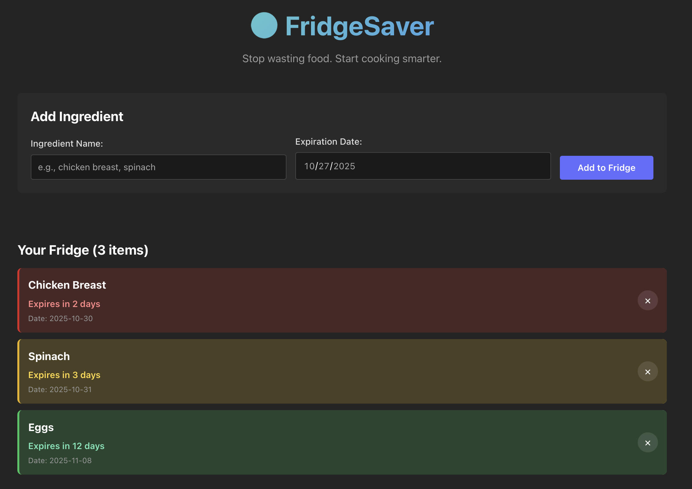
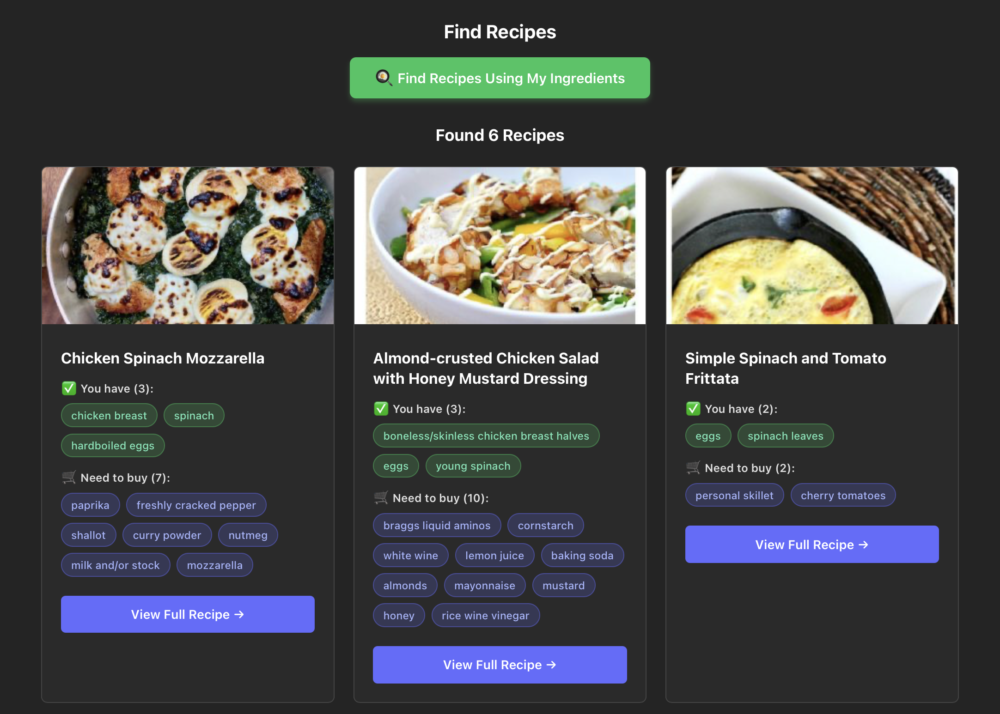

# 🥗 FridgeSaver - What's About to Expire Meal Planner

## Problem Statement
Every week, I waste food because I forget what's in my fridge until it's too late. I always try to buy healthy, fresh ingredients like spinach, chicken breast, or bell peppers, but life gets busy with classes, assignments, and social plans. By the time I remember that spinach sitting in the crisper drawer, it's already turned into a sad, slimy mess. Then I feel guilty about wasting $5 AND I have to order $15 worth of takeout because "I have nothing to eat" (even though my fridge is technically full of expired ingredients).

This cycle happens almost every week, and I know I'm not alone. According to the USDA, Americans waste about 30-40% of their food supply, costing the average family $1,500 per year. As a college student on a tight budget, I can't afford to throw money in the trash.

## Solution
FridgeSaver helps you actually use the groceries you buy before they go bad. You input what's currently in your fridge along with expiration dates, and the app suggests recipes that use those ingredients—prioritizing the ones expiring soonest. 

The app color-codes your ingredients by urgency (red for "use today!", yellow for "use this week", green for "still fresh") so you can see at a glance what needs to be cooked ASAP. Then with one click, it searches the Spoonacular API for recipes that use YOUR specific ingredients. No more scrolling through recipe sites trying to find something that matches what you have. No more food waste. No more guilt.

## API Used
- **API Name**: Spoonacular Food & Recipe API
- **API Documentation**: https://spoonacular.com/food-api/docs
- **Endpoint Used**: `GET /recipes/findByIngredients`
- **How it's used**: The "Search Recipes by Ingredients" endpoint is the perfect fit for this problem. I send it a comma-separated list of the ingredients currently in my fridge (e.g., "chicken breast, spinach, tomatoes"), and it returns recipes that use those ingredients. The API response tells me which of MY ingredients each recipe uses (`usedIngredients`), what additional ingredients I'd need to buy (`missedIngredients`), and how many of my ingredients vs. store ingredients each recipe requires. This lets me prioritize recipes where I already have most of the ingredients, reducing the barrier to actually cooking instead of ordering takeout.

## Features
- ✅ **Add ingredients** with expiration dates using a simple form
- ✅ **Visual expiration warnings** with color coding (🔴 Red = urgent, 🟡 Yellow = soon, 🟢 Green = fresh)
- ✅ **Auto-sorting** by expiration date so urgent items appear first
- ✅ **One-click recipe search** using your current ingredients
- ✅ **Smart recipe matching** that shows which ingredients you have vs. need
- ✅ **Flexible ingredient matching** uses keywords to maximize recipe options - be specific (e.g., "chicken breast") for targeted results
- ✅ **Delete ingredients** once you've used them
- ✅ **Loading states** while fetching recipes
- ✅ **Error handling** for API failures

## Setup Instructions

### 1. Clone this repository
```bash
git clone https://github.com/yourusername/fridge-saver.git
cd fridge-saver
```

### 2. Install dependencies
```bash
npm install
```

### 3. Get a Spoonacular API key
1. Go to https://spoonacular.com/food-api/console#Dashboard
2. Sign up for a free account
3. Copy your API key
4. Free tier: 150 requests/day

### 4. Add your API key
1. Copy the example environment file:
   ```bash
   cp .env.example .env
   ```
2. Open the `.env` file
3. Replace `your-api-key-here` with your actual API key:
   ```
   VITE_SPOONACULAR_API_KEY=abc123your-actual-key
   ```
4. Save the file
5. **IMPORTANT**: Never commit the `.env` file to GitHub (it's already in `.gitignore`)

### 5. Start the development server
```bash
npm run dev
```

### 6. Open in browser
Navigate to http://localhost:5173

## How to Use
1. Add ingredients from your fridge with expiration dates
2. The app automatically color-codes them by urgency
3. Click "Find Recipes Using My Ingredients"
4. Browse recipe results showing what you can make
5. Delete ingredients as you use them

## AI Assistance
I used **Claude (Sonnet 4)** to help with:

**API integration patterns**: Claude showed me async/await with try/catch error handling. I learned that the `finally` block always runs, making it perfect for setting loading states. Modified: Added specific error messages for missing API keys and implemented environment variable usage with Vite's `import.meta.env` for better security.

**Date calculations**: Claude explained JavaScript date subtraction and millisecond conversion. I learned dates can be subtracted directly. Modified: Added `.setHours(0,0,0,0)` to fix edge cases where "expires today" showed differently based on current time.

**Component structure**: Claude suggested breaking my 200-line App.jsx into smaller components following single responsibility principle. I learned each component should do ONE thing. Modified: Simplified by skipping separate container/presentational components for this small app.

**Array sorting logic**: Claude provided the comparison function for sorting by date. I learned spread operator creates a copy before sorting (avoiding mutation). Modified: Sorted on raw date strings instead of calculated values for cleaner code.

**Color coding**: Claude showed how to use functions to determine CSS classes conditionally. I learned early returns make code more readable than nested if/else. Modified: Changed urgency thresholds from 0/3/7 days to 0/2/5 days based on my actual food waste patterns.

## Screenshots

### App with Ingredients


### Recipe Results  


## Future Improvements
- Add local storage to persist ingredients between sessions
- Implement "Mark as cooked" button to remove multiple ingredients
- Add nutrition info for recipes
- Filter recipes by cooking time or dietary restrictions
- Barcode scanning for quick ingredient input
- Push notifications when ingredients are about to expire
- Shopping list generator from recipe ingredients
- Meal planning calendar

## What I Learned
This project taught me how to structure React apps with multiple components, work with external APIs, handle async operations, and implement good UX with loading/error states. I learned that AI tools are excellent for boilerplate code and debugging but require understanding the fundamentals to fix edge cases. Most importantly, I learned that starting with a specific problem leads to better solutions than starting with "I want to build X technology."